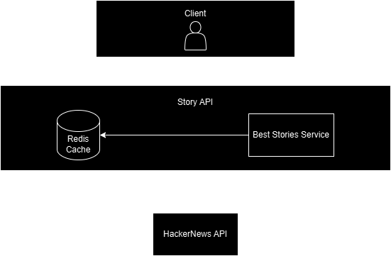
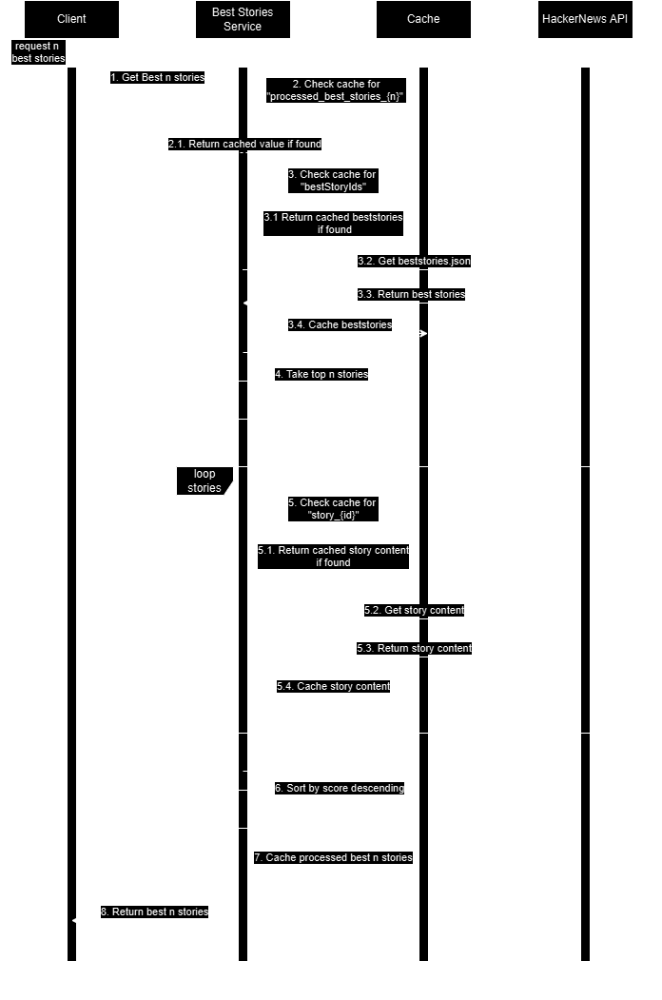

# HackerNews Wrapper

This README provides the steps to set up and run the `Story.API` project with Redis using Docker Compose. The application implements a RESTful API to retrieve the first `n` "best stories" from the Hacker News API and returns them sorted by score in descending order.

## Prerequisites

Ensure you have the following installed on your system:
- [Docker Desktop](https://docs.docker.com/desktop/setup/install/windows-install/)

## Running the Project

### Step 1: Build and Start Services

1. Open a terminal and navigate to the solution directory.
2. Run the following command to build and start the services:
   ```bash
   docker-compose up --build
   ```

   This will:
   - Build the `Story.API` Docker image.
   - Start the `Story.API` and Redis containers.

### Step 2: Verify Services

- Access the `Story.API` Swagger UI at: [http://localhost:5000/swagger](http://localhost:5000/swagger) (replace `5000` with the port configured in your `docker-compose.override.yml`, if different).
- Redis will be running internally and is accessible to `Story.API`.

### Step 3: Stopping Services

To stop the containers, press `Ctrl+C` in the terminal or run:
```bash
docker-compose down
```

### Optional: Running in Detached Mode

To run the services in the background, add the `-d` flag:
```bash
docker-compose up --build -d
```

### Optional: Debugging

Open `HackerNewsWrapper.sln` in Visual Studio 2022 and run the `Docker Compose` profile in Debug mode.

## High-Level Design



- **Client**: Consumer of the Story API.
- **Story API**: .NET 8 Web API project.
- **Best Stories Service**: Service responsible for retrieving best stories from Hacker News if not available in Redis cache.
- **Redis Cache**: Caches processed stories, best stories, and content for each story.
- **Hacker News API**: External API to retrieve data from Hacker News.

## Best Stories Service Sequence Flow



1. Client requests the top `n` best stories.
2. Checks for already processed `n` best stories in cache; if found, return processed stories.
3. If processed stories are not found, proceed with the normal flow. Check for best story IDs in cache. If not found, fetch them from Hacker News API and cache them.
4. Retrieve the top `n` stories from the cached best stories.
5. For each story, check if content is in cache by the key `story_{id}`. If not, fetch the content of each story from Hacker News API and cache it.
6. Sort stories by score in descending order.
7. Cache the processed top `n` stories.
8. Return the processed stories to the caller.

## Enhancements and Assumptions

### Assumptions

1. **Efficient Handling**: The application caches responses to reduce calls to the Hacker News API.
2. **Error Handling**: The API gracefully handles invalid `n` values and network errors.

### Potential Enhancements

1. **Pagination Support**: Add support for paginated responses.
2. **Authentication**: Implement authentication and authorization mechanisms to secure API endpoints and manage user access.
3. **Rate Limiting**: Introduce rate-limiting middleware for better API control.

## Author

Lukasz Sil ([sil.lukasz@gmail.com](mailto:sil.lukasz@gmail.com))

